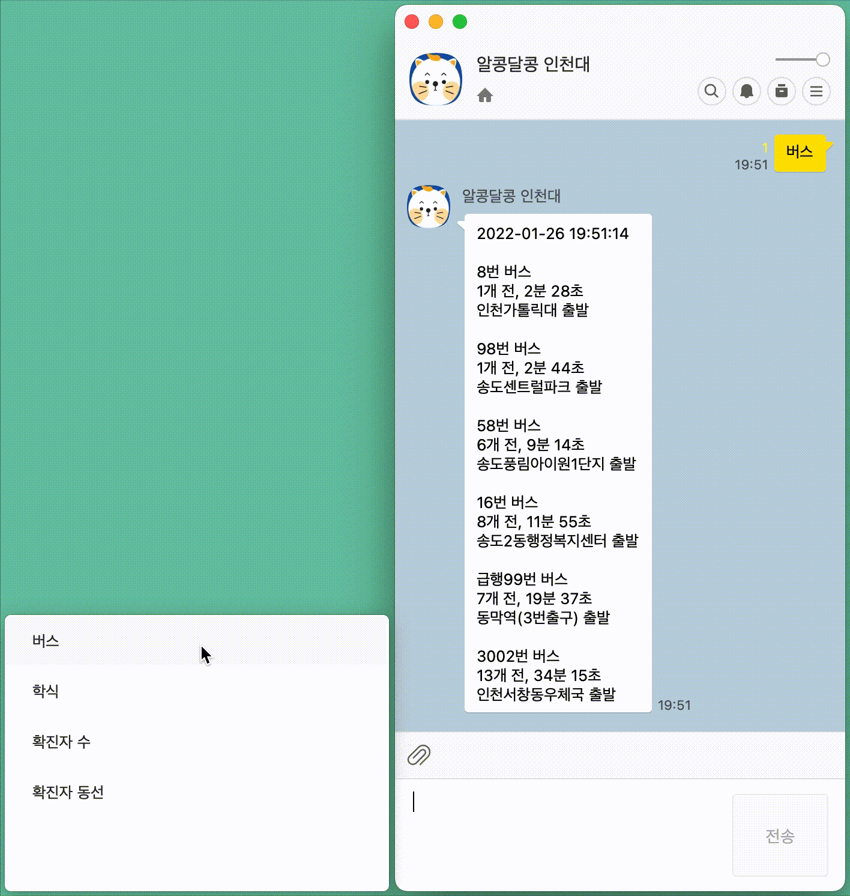

# 인천대 학우들의 편의를 위한 카카오톡 챗봇

## 동작

- <a href="http://pf.kakao.com/_pcjxnb">알콩달콩 인천대 사용해 보기</a>

## 인천대입구역 2번 출구 -> 인천대학교 버스 도착 정보

- <a href="https://www.data.go.kr/tcs/dss/selectApiDataDetailView.do?publicDataPk=15059084">인천광역시\_도착정보 조회</a>

- 07시 00분 ~ 00시 59분까지 20초 간격으로 갱신

- 90초 미만은 "곧 도착"으로 표기

- 인천대입구역 2번 출구 버스정류장 정보

  - SHORT_BSTOPID : 38395
  - BSTOPID : 164000395
  - 버스 노선 정보 (ROUTE ID)

    - 8번 (165000012)
    - 16번 (165000020)
    - 98번 (164000001)
    - 급행99번 (161000008)
    - 58번 (161000007)
    - 3002번 (213000019)

## 학식 메뉴

- <a href="https://www.inu.ac.kr/com/cop/mainWork/foodList1.do?siteId=inu&id=inu_050110010000">인천대학교 홈페이지 대학생활 > 식당메뉴</a>

- 매일 07시 00분 업데이트

## 전국 코로나 일일 확진자 수

- <a href="https://www.data.go.kr/data/15043378/openapi.do">공공데이터활용지원센터\_보건복지부 코로나19 시·도발생 현황</a>

- 매일 09시 부터 5분 간격으로 업데이트 완료될 때까지 시도

## 인천대학교 코로나 확진자 동선

- <a href="http://www.inu.ac.kr/user/boardList.do?boardId=648880&siteId=inu&id=inu_070213030000">인천대학교 홈페이지 확진자 교내 동선 알림</a>

- 07시 00분 ~ 23시 59분까지 1분 간격으로 갱신

- 가장 최근 확진자 동선 정보를 제공

- 학교 측에서 동선 정보를 이미지 파일로 업로드하여 이를 그대로 전달

## 배포

- <a href="https://i.kakao.com/docs/getting-started-overview">카카오톡 챗봇 관리자센터</a>

- AWS EC2 - ubuntu 18.04
